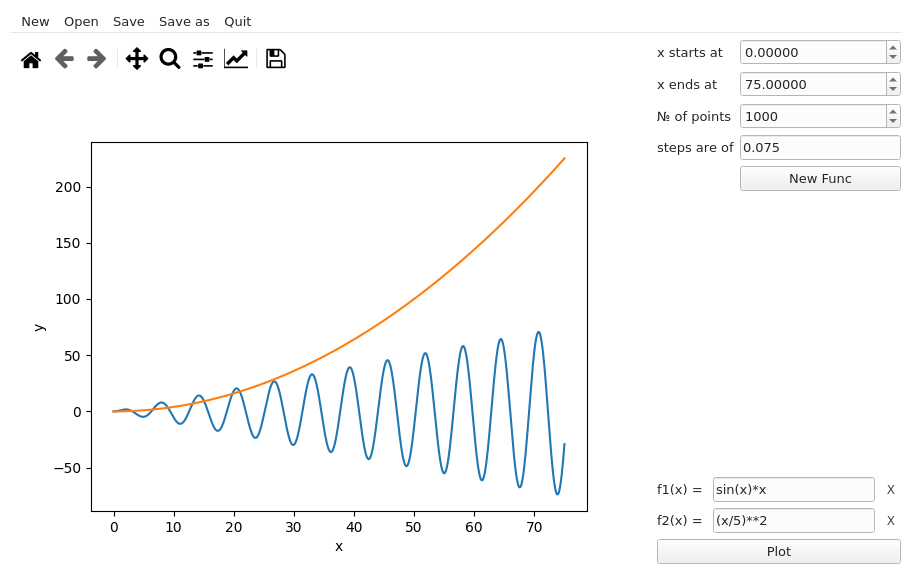

# LDV-plotter
    

This is a mathematics functions plotter. With this tool you can create beautiful plots and surprise your friends.

---

### Example:

In this example, i created a plot which contains two functions. They are:

* f(x) = sin(x) * x

* f2(x) = (x/5) ** 2

X starts at 0, and ends at 50. There are 500 points an the steps are of 0.1.  You can set these attributes. There a plot-toolbar too. You can save and re-open your projects by the menu.

---

### Installation:

Linux is officially supported, but you can install this on other os too. For installing on linux: `sudo ./INSTALL.sh` and it will put the applications files in opt. It will create a file in `/bin` named `ldv-plt` and a .desktop file in `/usr/share/applications`. For installing in other os, the dependencies are listed in `REQUIREMENTS.txt`, and the main file is `GUI.py` in `./scripts`. We suggest to use a virtual enviroment.
